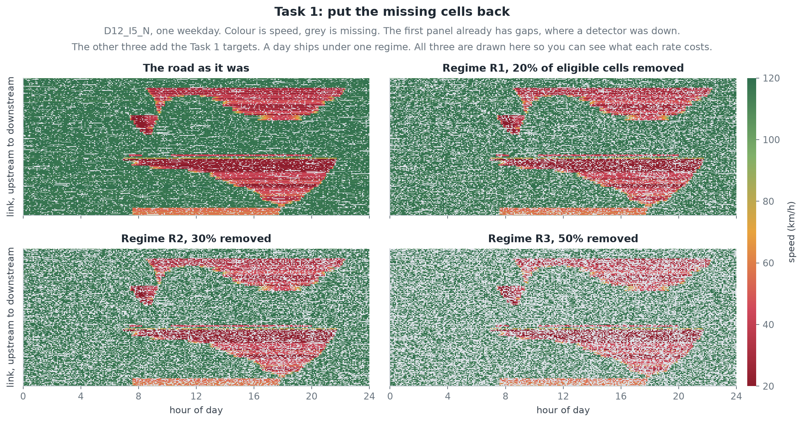

# TrafficFlowBench

A four-task freeway traffic benchmark for the 2026 IEEE Big Data Cup.

Ten directional freeway corridors at five-minute resolution, eleven months of
detector records, and four questions asked of the same road. The benchmark asks
you to reconstruct and explain a traffic system. It is not a contest to minimise
one prediction error. The four tasks are scored together, and the ones that pay
best are the ones a physically coherent method solves at the same time.

| Split | Length | Answers released | What it is for |
|---|---|:--:|---|
| `train` | 9 months, 273 days | **yes** | fitting, and scoring yourself |
| `validation` | 1 month, 31 days | no | practice submissions |
| `private` | 1 month, 30 days | no | the ranked evaluation |

The records are synthetic. They were generated by a calibrated traffic-flow
model, and the calibration came from real freeway detector data on these
corridors. There is more on this under [The data](#the-data).

- **Data**: the Kaggle competition Data page
- **Code, schemas, baselines, scoring rules**: this repository
- **Start here**: [`docs/RUN_LOCAL.md`](docs/RUN_LOCAL.md)

---

## Why these four tasks

Every task is a problem a traffic management centre actually has. They were
chosen because they need each other.

**Detectors fail, constantly.** On a real freeway a large share of every
five-minute record is missing, degraded, or imputed by the agency before anyone
sees it. Nothing downstream works until the gaps are filled. Not a control
strategy, not a travel-time estimate, not incident detection. **Task 1 is that.
Fill in the missing cells.**

**Knowing what is happening now is not the same as knowing what happens next.**
A queue that has just started spreads upstream faster than intuition suggests.
The decision to meter a ramp or post a warning has to be made before the queue
arrives. **Task 2 is that. From one hour of history, say which links are queued
over the next thirty minutes.**

**A reconstruction can fit every observation and still be impossible.** Fill in
missing cells with a smooth statistical model and you get plausible-looking
numbers that quietly violate conservation of vehicles. Cars appear and vanish
between detectors. That is the failure mode that makes an estimate useless for
control, and RMSE cannot see it. **Task 3 is that. Does your Task 1 answer obey
traffic-flow physics?** It is scored on the file you already submitted, so it
cannot be gamed on its own. The only way to raise it is to reconstruct better.

**Detectors count vehicles. They do not say where anyone is going.** Planning,
pricing and rerouting need origin-destination demand, which is never measured
directly and has to be inferred from link counts. The inverse problem is
underdetermined, so it needs a prior and it needs the counts to be right.
**Task 4 is that. Recover path flows from counts.**

Put together: fill the gaps, respect the physics, predict what comes next, and
explain where the traffic came from. That is the loop a traffic centre runs, and
no single one of those steps is worth much alone.



The congestion is still legible through the holes. That is what makes the task
solvable, and it is what lets a method that understands traffic beat one that
interpolates.

## How the tasks connect

```text
                  masked observations
                          │
                          ▼
        ┌────────  Task 1: reconstruct  ───────┐
        │                 │                    │
        │                 ▼                    ▼
        │        Task 3: is it physical?   Task 4: where did it come from?
        │        (scored on the very          (counts → path flows)
        │         same file, no submission)
        ▼
  Task 2: what happens in the next 30 minutes
   (60 min of history, independent windows)
```

Tasks 1 and 3 are the same submission judged twice, once for accuracy and once
for physical coherence. Task 4 consumes counts and network structure. Task 2
stands on its own, scored on separate short windows rather than on the month.

**A suggested order.** This is advice, not a rule. Solve them however you like.

1. **Task 1 first**, because Task 3 comes free with it and together they are half
   the total score. Get a reconstruction working end to end before tuning.
2. **Then Task 3**, by changing Task 1. Look at where conservation breaks. It is
   usually a smoother that produces beautiful speeds and inconsistent flows. A
   method built around the flow balance tends to lift both scores at once.
3. **Then Task 4.** It is a self-contained inverse problem, and a classical,
   well-regularised solver goes a long way.
4. **Task 2 last**, because it shares the least with the others. It is worth 0.30
   and the naive baseline scores 0.25, so it holds the largest proportional gain.

## Scoring

```text
S_total = 0.35*S_state + 0.30*S_queue + 0.15*S_physics + 0.20*S_ODME
```

Every component is on [0, 1], and 1 is perfect. Corridors are averaged equally.
A missing task output scores 0 rather than being skipped. The full rule is in
[`docs/SCORING_SPEC.md`](docs/SCORING_SPEC.md).

---

## Task 1: reconstruct the missing state

**What is tested.** Whether you can recover speed and flow at cells the release
has removed, using everything else. The rest of the corridor at that moment, the
same link at other times, and the corridor's own history.

**What you get.** `mainline_states_masked/`, where the target cells are blanked
to null, plus ramp flows and the full network. The removal rate is one of three
regimes. R1 removes 20% of eligible cells, R2 removes 30%, R3 removes 50%. Each
calendar day is published under exactly one of them.

**What you submit.** One speed and one flow for every blanked eligible cell. The
required rows are enumerated for you in
`task1/<PANEL>/<split>/sample_submission_state.csv`. Fill in two columns and you
have a valid submission. A missing row scores as a zero prediction and still
counts in the denominator.

**How it is scored.** Per regime, then averaged over the three:

```text
S_speed = max(0, 1 - RMSE_speed / 25)                # km/h
S_flow  = max(0, 1 - RMSE_flow_per_lane / 600)       # veh/h/lane
S_state = 0.54*S_speed + 0.46*S_flow
```

Flow RMSE is taken per lane. Against total link flow the same error scored very
differently on a three-lane and a six-lane corridor, which made corridors
incomparable on lane count alone.

**Baseline.** A weekday by time-of-day profile plus local interpolation:

```bash
python src/task1/build_task1_baseline_submission.py \
  --release-root $REL --split train --output state_submission.csv
python src/task1/score_task1.py \
  --submission state_submission.csv --release-root $REL --split train
```

---

## Task 2: predict the queue

**What is tested.** Short-horizon propagation. Not whether you can see the queue
that is already there, but whether you can tell where it goes next, and where a
new one is about to form.

**What you get.** Independent windows. Each gives you 60 minutes of observations
up to a forecast origin `T`, and asks about `T+5` through `T+30`. That is six
five-minute steps over every link. Windows come in two conditions, five of each
per corridor and split:

- `queue_onset`, where nothing is queued in the history and a queue appears in
  the horizon;
- `queue_ongoing`, where a queue is already visible at `T`.

Both guarantee a queue somewhere in the horizon. No window can be won by
predicting "no queue everywhere" and collecting a free mark.

**What you submit.** A binary indicator per link and future timestamp.

**How it is scored.** Space-time intersection over union per window, averaged
with equal weight across windows and conditions:

```text
IoU = |predicted AND true| / |predicted OR true|
```

A link is queued when its speed is at or below 0.60 times free-flow speed. The
label is taken from the underlying state rather than the noisy observation, so
measurement error cannot flip it back and forth at the threshold.

`D12_I405_N` and `D12_I405_S` are excluded from Task 2 only. They remain in the
other three tasks.

**Baseline.** Persistence, which repeats the queue state at `T` through all six
steps:

```bash
python src/task2/build_task2_persistence_submission.py \
  --release-root $REL --split validation --output queue_submission.csv
```

It scores 0.2518. Queue labels are withheld for every split, so this is one task
you cannot score yourself. `src/task2/score_task2.py` is published anyway, so you
can read exactly how the leaderboard will judge you.

---

## Task 3: is your reconstruction physical?

**What is tested.** Whether the numbers you submitted for Task 1 could describe
real traffic. Two things a real freeway always satisfies:

- **The fundamental diagram.** Speed, flow and density on a link are not
  independent. Given density, flow is bounded, and beyond a critical density
  flow falls rather than rises.
- **Conservation.** Vehicles do not appear or vanish. Over five minutes, the
  change in the number of vehicles on a link equals what came in, from upstream
  and from the on-ramp, minus what left.

```text
N(t+dt) - N(t) = dt * (q_in + r_on - q_out - r_off)
```

**What you submit.** Nothing. Task 3 is scored on your Task 1 file. The evaluator
derives the rest itself: density as `q/v`, accumulation as `k·L`, boundary flows
from the released topology, ramp flows from the released ramp observations.

This is deliberate. When Task 3 accepted its own submission, a participant could
declare `k = q/v_f` and score 0.9999 on the diagram term instead of an honest
0.8833. Or project boundary flows straight onto the conservation equation and
score a perfect 1.0 whatever state they had submitted. Anchoring the score to the
Task 1 answer closes both routes by construction.

**How it is scored.**

```text
S_physics = (1/3)*S_FD + (2/3)*S_LWR
```

`S_LWR` carries the discrimination. It falls monotonically as error is injected
and goes to zero for a submission that erases congestion, while `S_FD` moves by
less than 0.03 across the same range. Which transitions are scored depends on
your corridor's ramp-observation coverage. That table is frozen and published in
[`docs/TASK3_LWR_COVERAGE_MODES.md`](docs/TASK3_LWR_COVERAGE_MODES.md).

**You cannot score this one locally.** Conservation is checked against organizer
boundary flows, and those are never published. Inflow and outflow per link are
the flow field itself, which is the Task 1 answer. `score_task3.py` still runs,
but without them it falls back to a topology estimate that is too coarse for the
check, and every submission floors at the same number. On `D12_I5_N` a perfect
answer scores 0.3301 locally against 0.3299 for the naive baseline. With the
organizer flows those two are **0.9598 and 0.3242**. Read the evaluator for the
rule, and let the leaderboard produce the number.

That gap, 0.32 against 0.96, is the largest in the benchmark. It is the clearest
signal that fitting cells one at a time is not enough. The lever is the Task 1
answer, and Task 1 does score locally.

---

## Task 4: recover the demand

**What is tested.** The classical inverse problem of traffic estimation. Link
counts are observed, path flows are not, and there are far more paths than
independent measurements. A useful answer has to reproduce the counts and stay
close to what is plausible.

**What you get.** The path set, the path-link incidence matrix `A`, the released
link counts `c` for one demand period, and a weak path-flow prior `b`.

**What you submit.** One flow per path. Flows must be finite and non-negative.
`departure_time` is a period token rather than a timestamp, so copy it from the
template.

**How it is scored.** Four components:

- `S_od`, how close your path flows are to the reference;
- `S_link`, whether they reproduce the counts once loaded onto the network;
- `S_dev`, how far you moved from the prior against how far the reference moved;
- `S_attr`, whether your destination-attraction distribution is right.

```text
S_ODME = 0.45*S_od + 0.25*S_link + 0.15*S_dev + 0.15*S_attr
```

The `S_dev` term is what stops the two obvious degenerate answers: submitting the
prior unchanged, and fitting the counts exactly with a wild demand pattern.

**Baseline.** Non-negative least squares with prior regularisation:

```bash
python src/task4/build_task4_odme_artifacts.py \
  --release-root $REL --split validation --output-root task4_odme
```

---

## The data

Ten directional corridors, `D7_I10`, `D7_I210`, `D7_I405`, `D12_I5` and
`D12_I405`, each in both directions. Five-minute resolution, with mainline
detectors, ramp flows, link geometry, fundamental-diagram parameters, paths and
an OD prior.

`train` is the only split that ships the unmasked observation layer, so it is the
only split you can score yourself on. Recover the answer for a blanked cell by
joining `mainline_states_masked` to `mainline_states`.

Every cell carries `pct_observed`, and only cells with `pct_observed >= 75` and
non-null values are scored. About 76% qualify. The rest are still released.
Degraded data is part of the problem, not a defect in the package. An unavailable
ramp reading is unavailable evidence, never a measured zero. Treat it as zero and
Task 3 will cost you.

**The released records are synthetic.** A calibrated traffic-flow model
generated them. Its parameters were measured from real freeway detector data on
these same corridors: free-flow speed, per-lane capacity, jam density, demand by
weekday and time of day, the size of the measurement noise, and how often
detectors are available. No real record appears in the release. Nothing was
shifted, resampled or copied, and the released calendar matches no real period.

What that means for you: the data obeys real traffic physics and carries
realistic measurement error, but there is nothing to look it up in. There is no
external source to join against, and a method that works here is a method that
works on the road.

More in [`docs/DATA.md`](docs/DATA.md).

---

## Quick start

```bash
git clone https://github.com/jacky850/trafficflowbench-public.git
cd trafficflowbench-public
pip install -r requirements.txt

REL=/path/to/the/downloaded/data

python src/task1/build_task1_baseline_submission.py \
  --release-root $REL --split train --panel D12_I5_N --output state_submission.csv
python src/task1/score_task1.py \
  --submission state_submission.csv --release-root $REL --split train --panel D12_I5_N
```

One corridor runs in minutes. Drop `--panel` for all ten. Tasks 2 and 3 cannot be
scored locally, because their labels and boundary flows are withheld, so develop
against Task 1 and let the leaderboard score the rest. The full walkthrough,
including how to build the file you upload, is in
[`docs/RUN_LOCAL.md`](docs/RUN_LOCAL.md).

## What is here

```text
src/task1/   state baselines, submission builder, evaluator
src/task2/   persistence baseline, queue utilities, evaluator
src/task3/   the anchored physics evaluator
src/task4/   ODME baseline and evaluator
src/merge_submissions.py   three task files into one upload
config/      the corridor list, the release contract, the Task 3 mode table
docs/        the scoring rule, schemas, masks, data layout, baselines
```

| Document | What it answers |
|---|---|
| [`RUN_LOCAL.md`](docs/RUN_LOCAL.md) | How do I run any of this? |
| [`DATA.md`](docs/DATA.md) | What is in the package, and which split has answers? |
| [`SCORING_SPEC.md`](docs/SCORING_SPEC.md) | Exactly how is each number computed? |
| [`SUBMISSION_SCHEMAS.md`](docs/SUBMISSION_SCHEMAS.md) | What columns, what keys, what coverage? |
| [`MASK_SPEC.md`](docs/MASK_SPEC.md) | Which cells am I being asked about? |
| [`BASELINES.md`](docs/BASELINES.md) | What do the baselines do, and what do they score? |
| [`TASK3_LWR_COVERAGE_MODES.md`](docs/TASK3_LWR_COVERAGE_MODES.md) | Which transitions is my corridor judged on? |

## Rules, licence, contact

Official rules, deadlines, eligibility and prizes are on the **Kaggle competition
page**. That page is authoritative and this repository does not restate it.

Two rules are worth repeating here, because they are about the data rather than
the contest:

- **Do not submit values taken from an organizer-only file.** Every split has a
  legitimate route to an answer. None of them involves a file you were not given.
- **The released records are synthetic and are not a substitute for measured
  traffic data.** Please do not present them as observations of a real freeway.

The code in this repository is MIT licensed ([`LICENSE`](LICENSE)). If the
benchmark is useful in published work, [`CITATION.cff`](CITATION.cff) has the
citation metadata.

Questions about the data or the evaluators belong in the Kaggle discussion forum,
so the answer reaches everyone at once. Issues in this repository are for defects
in the code or the documentation.
