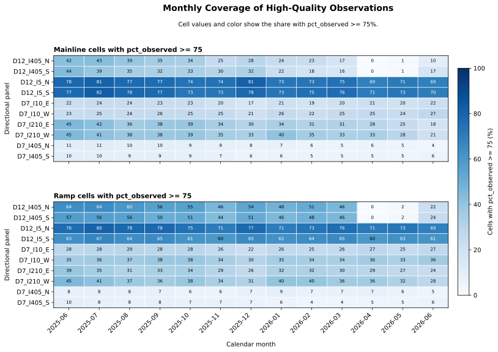
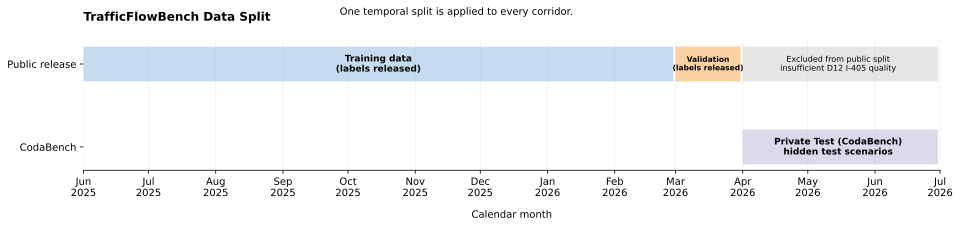

# TrafficFlowBench Public Participant Repository

TrafficFlowBench is a four-task freeway-traffic benchmark for the 2026 IEEE
Big Data Cup. The benchmark asks participants to reconstruct and explain a
traffic system, not only minimize one pointwise prediction error.

Participants use the public Kaggle data package to work on:

1. monthly masked traffic-state reconstruction;
2. online short-horizon queue prediction;
3. physical flow-consistency assessment; and
4. dynamic OD/path-flow estimation.

All participants use the same four-task scoring rule and one unified
leaderboard. There is no reasoning-text score, no expert-only score, and no
hard physics gate in Release 1.0.

This GitHub repository contains participant-facing code, schemas,
configuration, documentation, and simple baselines. The public data package
is distributed separately through the Kaggle Competition Data page.

## Competition architecture

~~~text
Kaggle Data page
  public observations, network, ramps, paths, masks, and templates
          |
          v
Participant method
  reconstruct states -> predict queues -> provide physical fields -> estimate OD/path flows
          |
          v
One unified submission.csv
  the task column identifies each task's rows
          |
          v
Kaggle private evaluation
  hidden labels and organizer-only evaluation assets
          |
          v
One composite leaderboard score
~~~

Public validation is for self-diagnostics. It is not a substitute for the
hidden Kaggle evaluation set and is not a leaderboard claim.

### End-to-end workflow

~~~mermaid
flowchart LR
    A["Kaggle public data train + validation"] --> B["Task 1 masked state reconstruction"]
    B --> C["Complete monthly state speed + flow + derived density"]
    C --> D["Task 3 FD and LWR consistency"]
    C --> E["Task 4 dynamic OD/path flow"]
    F["60-minute history at T"] --> G["Task 2 30-minute queue forecast"]
    B --> H["Unified submission.csv"]
    G --> H
    D --> H
    E --> H
    H --> I["Kaggle private evaluation"]
    I --> J["S_total leaderboard score"]
~~~

Tasks 1, 3, and 4 use the offline monthly state/data setting. Task 2 is an
online short-term forecast and uses its own released forecast-window index.

## Corridor coverage and time split

The release contains five corridor families and ten directional panels:

| Family | Directional panels |
|---|---|
| D7_I10 | D7_I10_E, D7_I10_W |
| D7_I210 | D7_I210_E, D7_I210_W |
| D7_I405 | D7_I405_N, D7_I405_S |
| D12_I5 | D12_I5_N, D12_I5_S |
| D12_I405 | D12_I405_N, D12_I405_S |

| Split | Period | Use |
|---|---|---|
| Public train | 2025-06-01 through 2026-02-28 | Model development and training |
| Public validation | 2026-03-01 through 2026-03-31 | Local self-diagnostics |
| Kaggle private evaluation | Hidden organizer-defined scenario | Official ranking |

PeMS did not publish station files for 2025-11-28 and 2025-11-29. Those dates
are excluded from the task indices; they are not treated as imputed values.
April through June 2026 are not part of the public train/validation release
because of inadequate D12 I-405 observation quality.

### Release coverage figures

The following figures summarize the public observation-quality audit and the
uniform train/validation split:

## Data channels and quality rule

The detector channels are:

- speed_kmh: measured speed, in km/h;
- flow_vph: measured flow, in vehicles/hour; and
- occupancy: measured occupancy fraction.

Density is a derived quantity, not a separate detector measurement. Where
needed, it is derived from speed and flow as:

$$
k = \frac{q}{v}.
$$

Task 1 scores speed and flow only. Occupancy and density are not independently
scored in Task 1.

A cell is eligible for accuracy scoring when:

~~~text
is_score_eligible = pct_observed >= 75 and required values are non-null
~~~

The legacy is_imputed flag may still be true when pct_observed < 100; this
does not automatically make a cell unusable. Ramp records and their quality
flags are retained because they are needed for physical consistency and ODME.

## What participants submit

Participants submit one unified CSV using the official Kaggle
sample_submission.csv as the definitive key and column template. The file is
a task-tagged long table. It is formed by vertically concatenating the four
task outputs, not by joining them on timestamp:

~~~text
state   -> Task 1 rows
queue   -> Task 2 rows
physics -> Task 3 rows
odme    -> Task 4 rows
~~~

The task column identifies which task owns each row. Use the released panel,
link, station, path, zone, timestamp, mask, and window identifiers exactly as
provided. Do not add hidden labels or private test answers.

## Task 1 — Monthly masked traffic-state reconstruction

Task 1 is an offline monthly reconstruction problem. For each required masked
cell, participants predict speed_kmh and flow_vph under three deterministic
mask regimes:

| Regime | Mask rate |
|---|---:|
| R1 | 20% |
| R2 | 30% |
| R3 | 50% |

The Task 1 key is:

~~~text
(panel, timestamp, station_id, link_id, mask_regime)
~~~

Density does not need to be submitted for Task 1 scoring. If a later task needs
density, derive it consistently from the submitted speed and flow.

For each regime r:

$$
S_v^{(r)} = \max\left(0,1-\frac{\mathrm{RMSE}_v^{(r)}}{25}\right),
$$

$$
S_q^{(r)} = \max\left(0,1-\frac{\mathrm{RMSE}_q^{(r)}}{600}\right),
$$

$$
S_{\mathrm{state}}^{(r)}
=0.54S_v^{(r)}+0.46S_q^{(r)}.
$$

The final Task 1 score is the equal average of the three regimes:

$$
S_{\mathrm{state}}
=\frac{S_{\mathrm{state}}^{(R1)}+S_{\mathrm{state}}^{(R2)}+S_{\mathrm{state}}^{(R3)}}{3}.
$$

Only score-eligible measured cells contribute to the accuracy score.

## Task 2 — Online queue prediction

Task 2 is an online short-term prediction problem, not a month-long forecast.
For each released forecast window, participants receive the 60 minutes through
the forecast origin T and predict binary queue status from T+5 through T+30
minutes.

The submission key is:

~~~text
(window_id, timestamp, link_id)
~~~

queue_pred must be exactly binary 0 or 1. The participant-visible condition
is determined from the recent history available at T; future queue labels are
not supplied to participants. Windows are separated by at least 360 minutes
within each panel/condition group.

For one forecast window, let Qhat be the predicted set of queued link-time
cells and Q* the hidden reference set:

$$
\operatorname{IoU}_{ST}
=\frac{|Q_{\mathrm{pred}}\cap Q_{\mathrm{true}}|}
       {|Q_{\mathrm{pred}}\cup Q_{\mathrm{true}}|}.
$$

In plain notation:

~~~text
IoU_ST = |Q_pred intersection Q_true| / |Q_pred union Q_true|
~~~

If both sets are empty, the score is 1. Missing required prediction rows
receive a score of 0 for the affected cells. Normal and disruption windows
receive equal weight within each panel. Panel scores are averaged within
families, and family scores are averaged equally.

Due to insufficient public ramp-observation quality, D12_I405_N and
D12_I405_S are excluded from Task 2 scoring only. They remain part of Tasks
1, 3, and 4.

### Task 2 workflow

~~~mermaid
flowchart LR
    A["60 minutes observed through origin T"] --> B["Participant model"]
    B --> C["queue_pred = 0 or 1 for T+5 ... T+30"]
    C --> D["Space-time IoU per forecast window"]
    D --> E["Equal normal/disruption panel average"]
~~~

## Task 3 — Physical consistency

Task 3 evaluates the complete reconstructed physical field rather than only
the masked Task 1 cells. The required fields include speed, flow, derived
density, inflow, outflow, accumulation, on-ramp flow, off-ramp flow, and the
corresponding ramp-validity indicators.

The physical units are explicit:

- Fundamental-diagram checks use per-lane quantities:
  q_lane = q_total / lanes, k_lane = k_total / lanes.
- Vehicle conservation uses total-flow quantities over the network links.

The conservation relation is:

$$
N_\ell(t+\Delta t)
=N_\ell(t)+\Delta t\,[q_{\mathrm{in}}(t)+r_{\mathrm{on}}(t)-q_{\mathrm{out}}(t)-r_{\mathrm{off}}(t)].
$$

The locked Release 1.0 score is:

$$
S_{\mathrm{physics}}
=\frac{1}{3}S_{\mathrm{FD}}+\frac{2}{3}S_{\mathrm{LWR}}.
$$

The three coverage modes are fixed by the released public ramp audit:

- **Mode A — high ramp coverage:** valid ramp observations anchor the LWR
  transition whenever an attached ramp is present.
- **Mode B — partial ramp coverage:** valid ramp transitions are used; an
  attached-ramp transition with an invalid ramp cell is omitted rather than
  filled with zero. No-ramp mainline segments still use mainline LWR.
- **Mode C — low ramp coverage:** only mainline segments without usable ramp
  evidence are used for the LWR score. This prevents poor ramp data from
  becoming a penalty for either organizers or participants.

The mode is a fixed organizer-released evaluation choice, not a participant
hyperparameter. S_qkv is diagnostic only because density is derived from
submitted flow and speed.

### Task 3 workflow

~~~mermaid
flowchart LR
    A["Task 1 reconstructed monthly state"] --> B["Derive density k = q / v"]
    C["Network topology lanes + capacities"] --> D["FD check"]
    E["Mainline and ramp flow fields"] --> F["LWR conservation check"]
    B --> D
    A --> F
    D --> G["S_physics"]
    F --> G
~~~

## Task 4 — Dynamic ODME and path-flow recovery

Task 4 estimates nonnegative path flows on the released directional network.
The release provides network links, legal paths, origin/destination zones,
path-link incidence, weak prior, and public count context.

The path-flow key is:

~~~text
(panel, departure_time, path_id, origin_zone, destination_zone)
~~~

departure_time is a released period token, not an arbitrary timestamp.
Submitted path flows must be finite, nonnegative, connected, and consistent
with the released path and zone identifiers.

Let f* be the organizer reference path flow, fhat the submitted path flow,
A the released path-link incidence matrix, and c the reference link counts:

$$
S_{od}
=\max\left(0,1-\frac{\sum_j|\widehat f_j-f_j^*|}
{\max(\sum_j f_j^*,\varepsilon)}\right),
$$

$$
S_{link}
=\max\left(0,1-\frac{\sum_\ell|(A\widehat f)_\ell-c_\ell|}
{\max(\sum_\ell c_\ell,\varepsilon)}\right).
$$

With weak prior b:

$$
D_{\mathrm{hat}}=\sum_j|\widehat f_j-b_j|,
\qquad
D^*=\sum_j|f_j^*-b_j|,
$$

$$
S_{dev}=\exp\left(-\left|\frac{D_{\mathrm{hat}}}{D^*}-1\right|\right).
$$

The attraction score is:

$$
S_{attr}=\max\left(0,1-0.5\|\widehat a-a^*\|_1\right).
$$

The final ODME score is:

$$
S_{ODME}=0.45S_{od}+0.25S_{link}+0.15S_{dev}+0.15S_{attr}.
$$

Invalid IDs, illegal paths, mismatched zones, duplicate keys, missing paths,
negative flows, or non-finite values invalidate the affected panel.

### Task 4 workflow

~~~mermaid
flowchart LR
    A["Released paths + zones"] --> C["Path-flow estimate"]
    B["Incidence matrix A and count context"] --> C
    C --> D["Load paths onto links"]
    D --> E["S_od + S_link + S_dev + S_attr"]
    E --> F["S_ODME"]
~~~

## Overall leaderboard score

The four task scores are combined into one score, where higher is better:

$$
S_{\mathrm{total}}
=0.35S_{\mathrm{state}}+0.30S_{\mathrm{queue}}
+0.15S_{\mathrm{physics}}+0.20S_{ODME}.
$$

Directional panels are averaged equally within each of the five corridor
families, and the five family scores are averaged equally. If one task is
missing or invalid, that task receives its configured default score of zero;
other valid task outputs are still evaluated.

## Repository layout

~~~text
config/       Public corridor, quality-date, and Task 3 mode configuration
docs/         Competition, scoring, schema, quality, baseline, and run docs
src/task1/    Task 1 baselines and scorer
src/task2/    Task 2 queue baseline and scorer
src/task3/    Task 3 physics baseline and scorer
src/task4/    Task 4 ODME baseline and scorer
src/          Unified submission and overall-score helpers
~~~

No raw PeMS archive, private test label, organizer solution, hidden queue
target, private evaluator, private count, or CTM scenario is included in this
repository.

## Quick start

Install dependencies:

~~~powershell
python -m pip install -r requirements.txt
~~~

Download the public data package from Kaggle and set its local path:

~~~powershell
$release = "C:\path\to\kaggle_release"
~~~

Detailed commands are available in:

- [docs/RUN_LOCAL.md](docs/RUN_LOCAL.md)
- [docs/SUBMISSION_SCHEMAS.md](docs/SUBMISSION_SCHEMAS.md)
- [docs/SCORING_SPEC.md](docs/SCORING_SPEC.md)
- [docs/BASELINES.md](docs/BASELINES.md)
- [docs/DATA_QUALITY.md](docs/DATA_QUALITY.md)
- [docs/TASK3_LWR_COVERAGE_MODES.md](docs/TASK3_LWR_COVERAGE_MODES.md)
- [docs/KAGGLE_OFFICIAL_RULES.md](docs/KAGGLE_OFFICIAL_RULES.md)

To merge four task-specific files into the unified participant submission:

~~~powershell
python -B src\merge_submissions.py --state state_submission.csv --queue queue_submission.csv --physics physics_submission.csv --odme path_flow_submission.csv --output submission.csv
~~~

The organizer-only hidden solution and private evaluator are not required for
local participant development. Public-validation scoring checks schema, row
coverage, and implementation behavior before submission.

## Public-validation QA reference

The following values are reference self-diagnostics for the Release 1.0 public
validation package and supplied baselines. They are not guarantees for the
hidden Kaggle leaderboard:

| Component | Score | Weight | Contribution |
|---|---:|---:|---:|
| Task 1 — state | 0.591069 | 0.35 | 0.206874 |
| Task 2 — queue | 0.543117 | 0.30 | 0.162935 |
| Task 3 — physics | 0.243610 | 0.15 | 0.036542 |
| Task 4 — ODME | 0.839270 | 0.20 | 0.167854 |
| **Overall** | **0.574205** | **1.00** | **0.574205** |

These numbers are included only to help verify a local installation. A
different valid method is expected to obtain different scores.

## Data provenance and attribution

Traffic observations are derived from California PeMS data and are provided
subject to the terms stated on the Kaggle Competition Data page. Network
materials derived from OpenStreetMap must retain the attribution:

~~~text
© OpenStreetMap contributors
~~~

Participants must comply with the competition rules, applicable source-data
terms, and the licenses stated on the Kaggle Data page.
